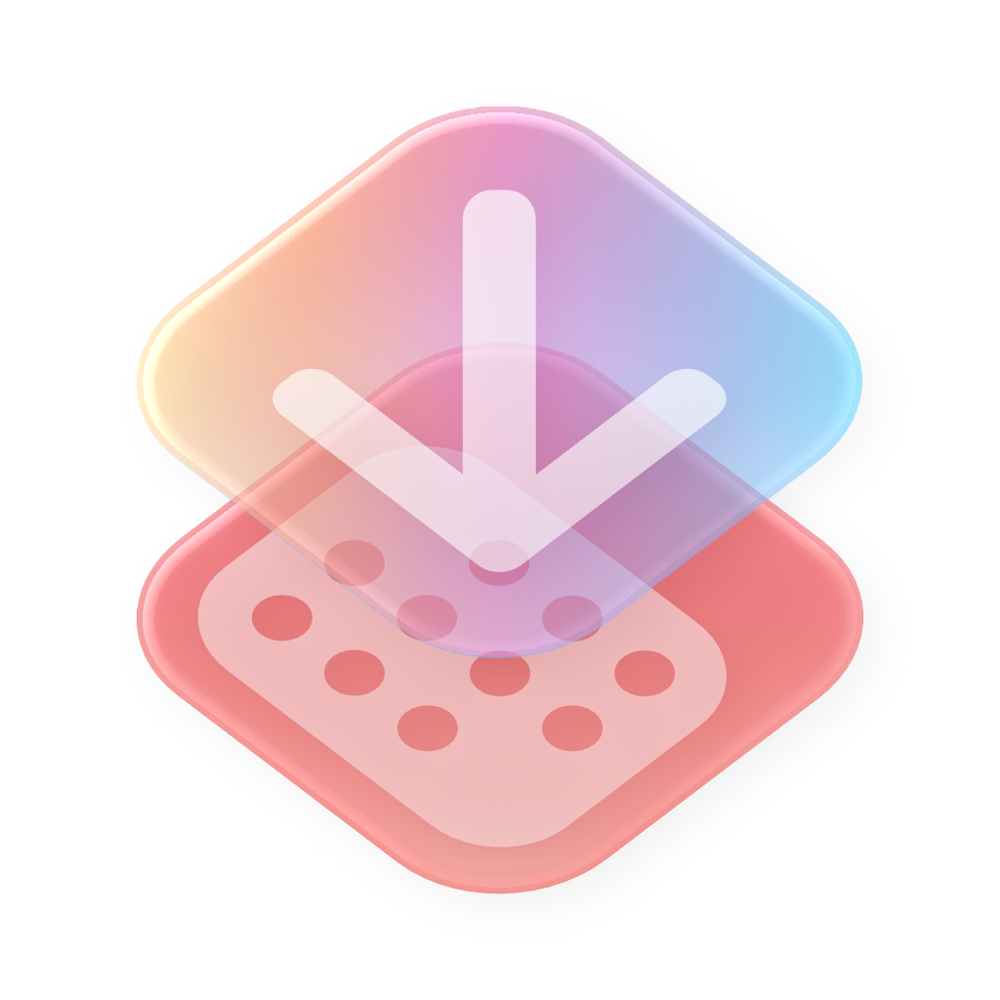

<!--
THIS FILE IS AUTOMATICALLY GENERATED - EDITS WILL BE OVERRIDDEN
-->

🇬🇧 English

  **[🇬🇧 English](README.md)**\
  [🇨🇳 中文 (简体)](docs/Chinese/README.md)

 

    
    <h1>AutoPlan v0.4.0</h1>
    
Extract calendar events and reminders from text or images using LLM — right from the menu bar.

  
  
  
  

 

## Features

Copy any text or screenshot to your clipboard, click **Extract from Clipboard** in the menu bar, and AutoPlan parses it into structured calendar events or reminders using your preferred LLM.

- **Clipboard Extraction** — Works with plain text, emails, chat messages, or screenshots
- **Smart Recognition** — LLM-powered parsing understands dates, times, locations, and context; images are processed via OCR automatically
- **Calendar & Reminders** — Saves directly to Apple Calendar and Reminders with one click
- **Menu-Bar Native** — Lives in your status bar; no dock icon, no window clutter

## Quick Start

1. Download the latest build from [Releases](https://github.com/FisherRone/AutoPlan/releases) or clone and build with Xcode
2. Launch the app — it appears in your menu bar
3. Open **Settings** → **Model Config** and add your LLM API key
4. Copy text or a screenshot to your clipboard, then click **Extract from Clipboard** in the menu bar
5. Review the extracted events and click **Save** to add them to Calendar / Reminders

## Customization

AutoPlan is built to fit your workflow. Choose any OpenAI-compatible provider, fine-tune how events are categorized, and even write your own extraction prompt.

### General Settings & Providers

    
    &nbsp;&nbsp;
    

- **Model Config** — Add your own API keys for OpenAI, DeepSeek, or any OpenAI-compatible endpoint; test connectivity with one click
- **Extraction Model** — Pick which model handles the parsing
- **Confirmation Toggle** — Choose whether to review events before saving, or save instantly
- **Launch at Login** — Start AutoPlan automatically when you log in

### Advanced Settings & Prompt Variables

    
    &nbsp;&nbsp;
    

- **Custom Prompts** — Override the default extraction prompt with your own; edit in any text editor
- **User Rules** — Layer extra instructions on top of the default prompt without replacing it
- **List Management** — Choose which Calendar and Reminders lists to use; add per-list descriptions to improve categorization accuracy
- **Prompt Variables** — Use placeholders like `{{BASE_INSTRUCTION}}`, `{{CURRENT_TIME}}`, and `{{LISTS}}` to build dynamic prompts

## Privacy

- **No data collection** — AutoPlan does not collect any information; clipboard content is sent directly to your chosen LLM provider for processing.
- **Local OCR** — Images from the clipboard are processed on-device using Apple's Vision framework.
- **Calendar & Reminders access** — Write permission is required to save extracted events to Apple Calendar or Reminders. Read permission is used to fetch your lists so events can be auto-categorized.
- **Secure key storage** — API keys are stored in the macOS Keychain, encrypted with your device passcode.

## Requirements

- macOS 15.0+
- An API key for an OpenAI-compatible LLM service (OpenAI, DeepSeek, etc.)

> ⚠️ **First Launch Warning**: Because AutoPlan is ad-hoc signed, macOS may block the app on first open with a malware warning. If this happens, please check the `Installation Guide.txt` in the release ZIP for step-by-step instructions, or view it [here](https://github.com/FisherRone/AutoPlan/blob/main/docs/English/Installation%20Guide.txt).

## Build

Open `AutoPlan/AutoPlan.xcodeproj` in Xcode, select the **AutoPlan** scheme, and build.

## License

MIT
