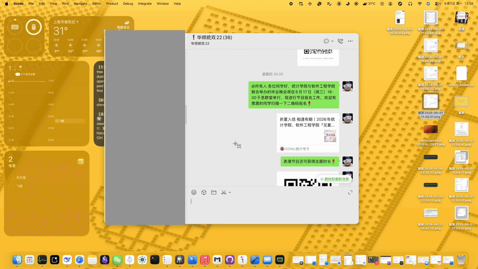
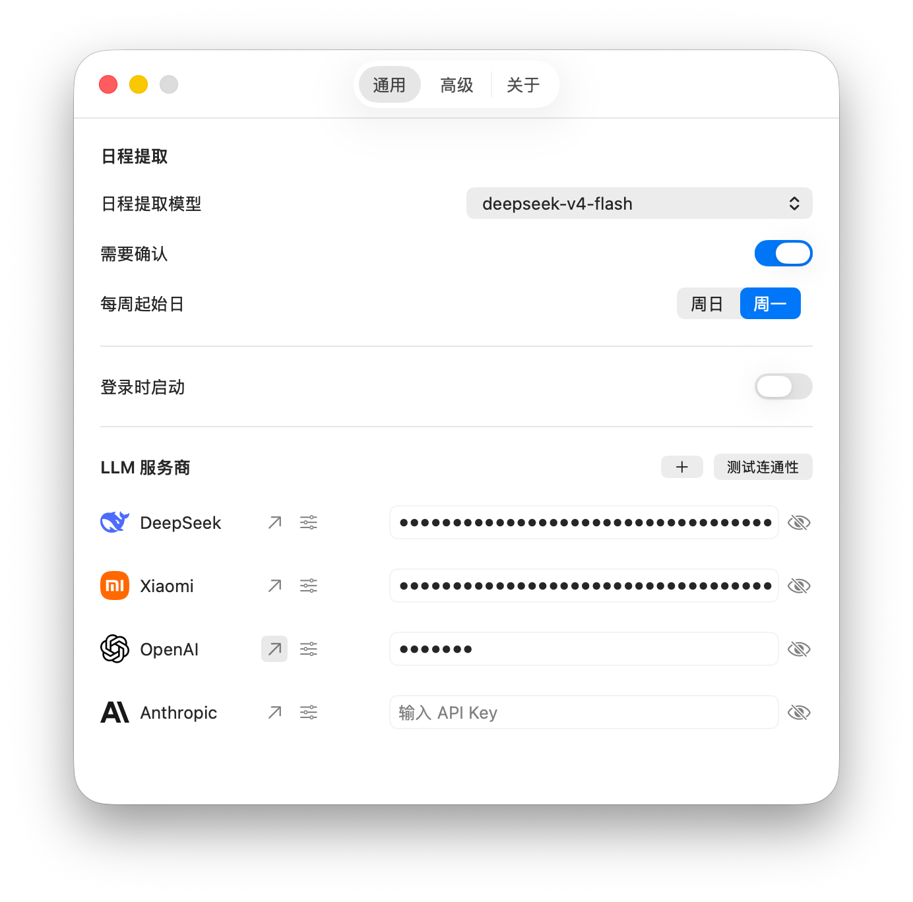
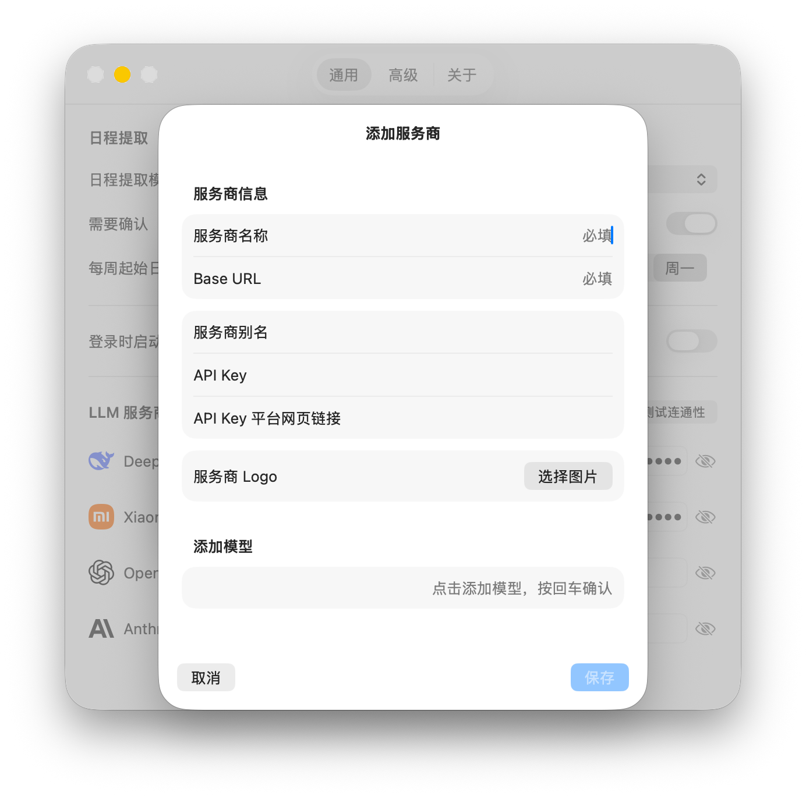
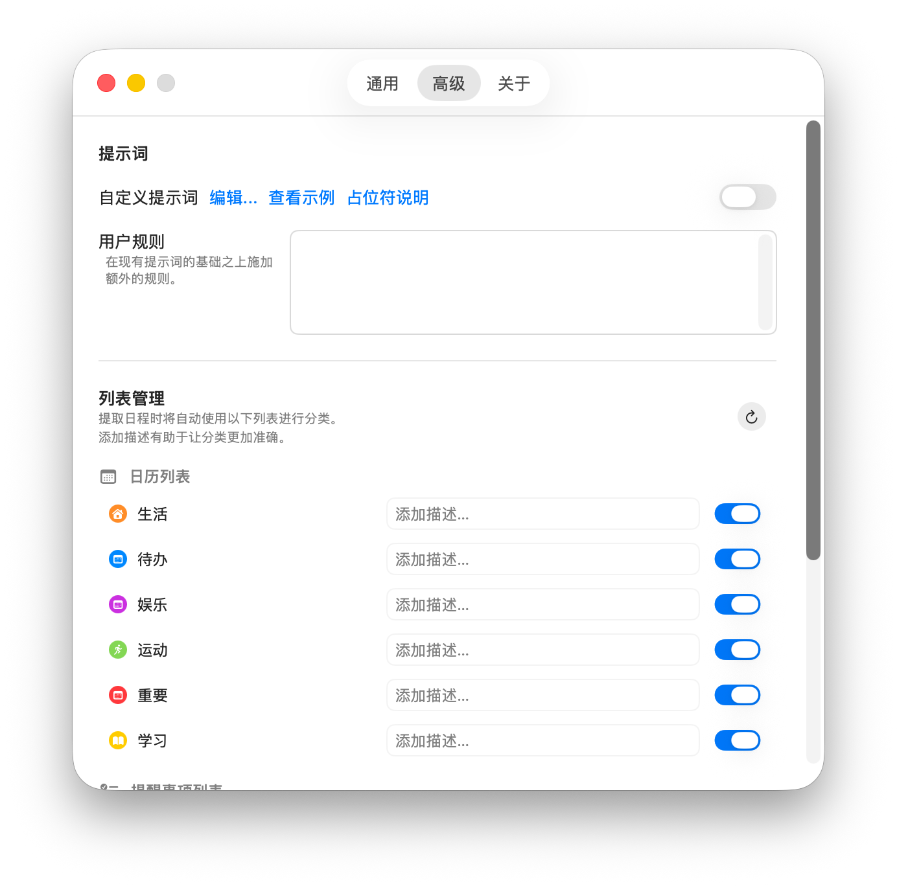
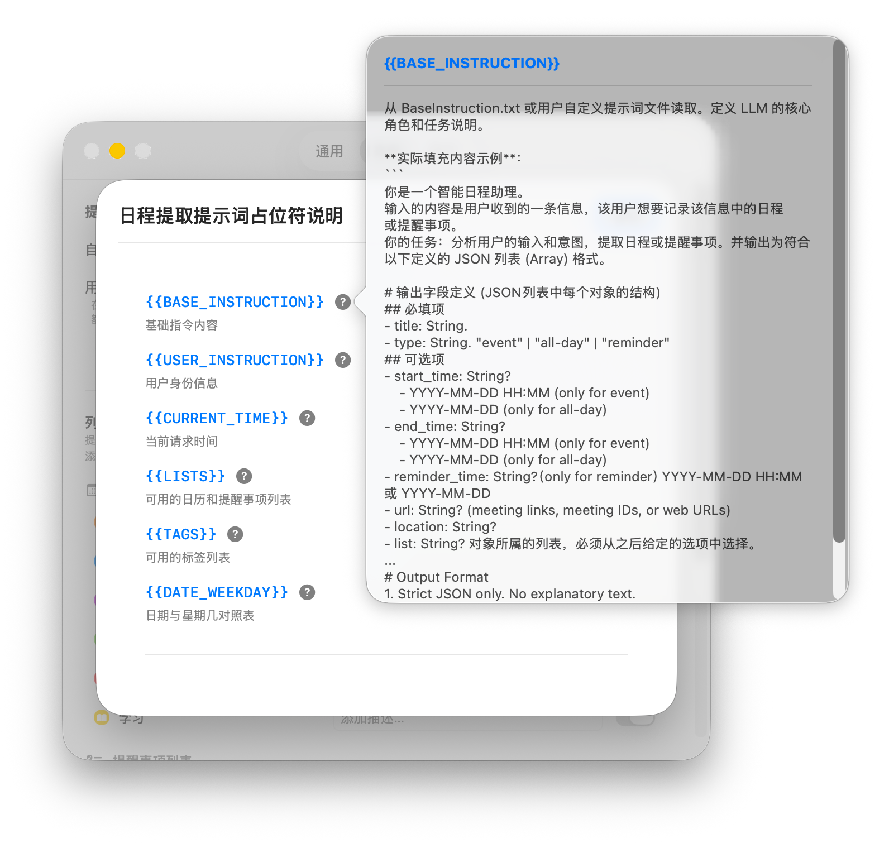

<!--
THIS FILE IS AUTOMATICALLY GENERATED - EDITS WILL BE OVERRIDDEN
-->

[🇬🇧English](https://github.com/FisherRone/AutoPlan) | 🇨🇳简体中文

    
    <h1>AutoPlan v0.4.0</h1>
    
利用 LLM 从文本或图片中提取日程和提醒事项 —— 直接从菜单栏操作。

  
  
  
  

 

## 功能特性

复制任意文本或截图到剪贴板，点击菜单栏中的**从剪贴板提取日程**，AutoPlan 会使用你首选的 LLM 将其解析为结构化的日程事件或提醒事项。

- **剪贴板提取** — 支持纯文本、邮件、聊天消息或截图
- **智能识别** — 基于 LLM 的解析能力，理解日期、时间、地点和上下文；图片通过 OCR 自动处理
- **日历与提醒事项** — 一键保存到 Apple 日历和提醒事项
- **原生菜单栏** — 驻留在状态栏中；无 Dock 图标，无窗口干扰

## 快速开始

1. 从 [Releases](https://github.com/FisherRone/AutoPlan/releases) 下载最新构建版本，或使用 Xcode 克隆并构建
2. 启动应用 —— 它会出现在你的菜单栏中
3. 打开**设置** → **模型配置**并添加你的 LLM API Key
4. 将文本或截图复制到剪贴板，然后点击菜单栏中的**从剪贴板提取日程**
5. 查看提取的事件并点击**保存**以添加到日历 / 提醒事项

## 自定义

AutoPlan 专为适配你的工作流而设计。选择任何 OpenAI 兼容的服务商，微调事件的分类方式，甚至编写你自己的提取提示词。

### 通用设置与服务商

    
    &nbsp;&nbsp;
    

- **模型配置** — 为 OpenAI、DeepSeek 或任何 OpenAI 兼容端点添加你自己的 API Key；一键测试连通性
- **提取模型** — 选择哪个模型负责解析
- **确认开关** — 选择是否在保存前预览事件，或立即保存
- **登录时启动** — 登录时自动启动 AutoPlan

### 高级设置与提示词变量

    
    &nbsp;&nbsp;
    

- **自定义提示词** — 用你自己的提示词覆盖默认提取提示词；可在任意文本编辑器中编辑
- **用户规则** — 在默认提示词之上叠加额外指令，无需替换它
- **列表管理** — 选择要使用的日历和提醒事项列表；为每个列表添加描述以提高分类准确性
- **提示词变量** — 使用 `{{BASE_INSTRUCTION}}`、`{{CURRENT_TIME}}` 和 `{{LISTS}}` 等占位符构建动态提示词

## 隐私

- **不收集数据** — AutoPlan 不收集任何信息；剪贴板内容直接发送给你选择的 LLM 服务商进行处理。
- **本地 OCR** — 来自剪贴板的图片使用 Apple 的 Vision 框架在设备端处理。
- **日历与提醒事项权限** — 写入权限用于将提取的日程保存到 Apple 日历或提醒事项。读取权限用于获取你的列表，以便自动分类日程。
- **安全密钥存储** — API Key 存储在 macOS 钥匙串中，使用你的设备密码加密保护。

## 系统要求

- macOS 15.0+
- OpenAI 兼容 LLM 服务的 API Key（OpenAI、DeepSeek 等）

> ⚠️ **首次启动警告**：由于 AutoPlan 使用 ad-hoc 签名，macOS 可能会在首次打开时拦截应用并显示恶意软件警告。如果发生这种情况，请查看发布 ZIP 中的 `安装指南.txt` 获取分步说明，或[点击此处](安装指南.txt)查看。

## 构建

在 Xcode 中打开 `AutoPlan/AutoPlan.xcodeproj`，选择 **AutoPlan** 方案并构建。

## 许可证

MIT
